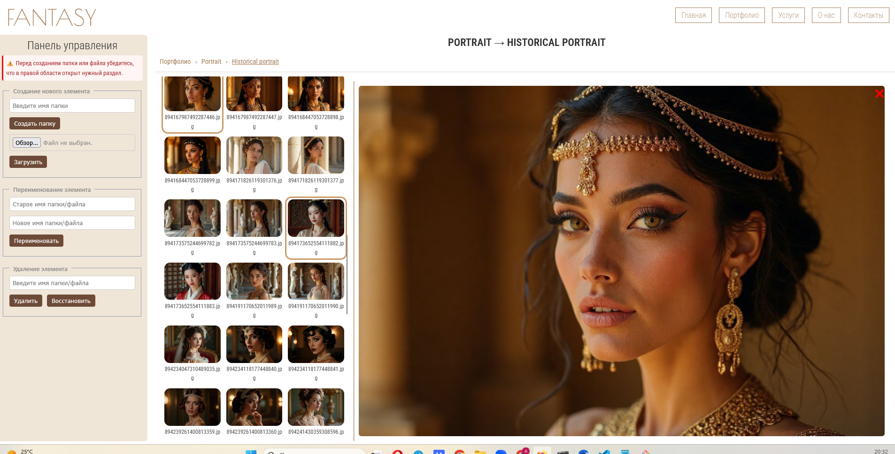
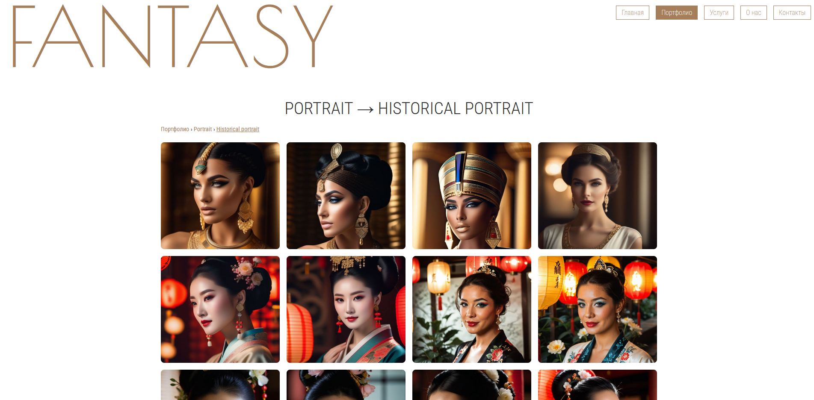

# Admin Panel Portfolio

Этот проект — учебный демонстрационный сайт с портфолио и административной панелью.  
Цель — показать работу клиентской и серверной частей, а также взаимодействие с файловой системой.

Автор: **Angevicka Bond**

---

## ✨ Возможности

- 📂 Просмотр структуры «портфолио» (каталоги + изображения)  
- 🖼 Предпросмотр изображений с возможностью изменения ширины панели  
- ➕ Создание папок и загрузка файлов  
- ✏️ Переименование файлов и папок  
- ❌ Удаление элементов  
- 🧩 Генерация JSON-структуры с данными для отображения  
- 🌐 Серверная часть на **Node.js + Express**  
- ⚡️ Деплой на **Render**

---

## 🖥 Скриншоты

### 🔹 Админ-панель с предпросмотром


### 🔹 Главная страница портфолио


---

## 🚀 Запуск проекта

1. Клонировать репозиторий:
   ```bash
   git clone https://github.com/vicmaybon-dotcom/portfolio-visagist
   cd repo-folder

2. Установить зависимости:

npm install

3. Запуск локально:

npm run dev


⚡️ Эта команда сначала пересоздаёт JSON (regen.js), потом стартует сервер (server.js).

4. Открыть в браузере:

http://localhost:3000   

📦 Используемые технологии

Frontend: HTML, CSS, JavaScript (Vanilla)

Backend: Node.js, Express

Загрузка файлов: Multer

Документация API: Swagger UI

Хостинг: Render

📝 Заметка

Репозиторий демонстрационный, без использования Persistent Disk (в Render данные не сохраняются после перезапуска).

Однако все тестовые медиа-файлы хранятся в GitHub и доступны для проверки функционала.

📧 Контакты

Автор: Angevicka Bond